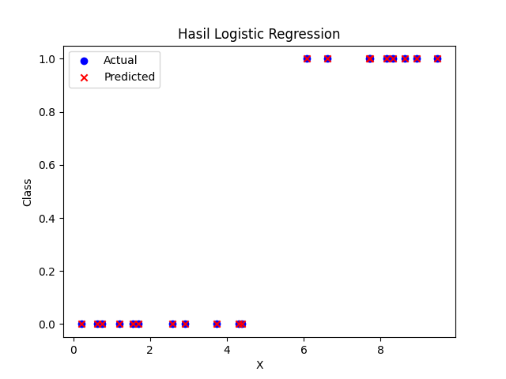

# logistic-regression-streamlit-app
Aplikasi web interaktif sederhana untuk klasifikasi biner menggunakan Logistic Regression yang dibangun dengan Streamlit dan scikit-learn.

# 📦 Logistic Regression Streamlit App

Proyek ini merupakan implementasi sederhana dari **Logistic Regression** menggunakan `scikit-learn`, dan disajikan dalam bentuk **web app interaktif menggunakan Streamlit**.

## 🚀 Fitur

- [✓] Dataset sintetik dari NumPy
- [✓] Training model Logistic Regression
- [✓] Simpan model ke file `.pkl`
- [✓] Web UI interaktif untuk prediksi (input angka, hasil klasifikasi, dan probabilitas)
- [✓] Visualisasi hasil model

## 📁 Struktur Proyek

```
.
├── app.py                 # Streamlit app untuk prediksi interaktif
├── main.py                # Training model dan menyimpan ke pickle
├── requirements.txt       # Daftar dependency Python
├── .gitignore             # File/folder yang diabaikan Git
├── models/
│   └── logistic_model.pkl # File model hasil training
└── outputs/
    └── hasil_logistic_regression.png  # Visualisasi hasil model
```

## ⚙️ Instalasi

```bash
# 1. Clone repository ini
git clone https://github.com/username/logistic-regression-streamlit-app.git
cd logistic-regression-streamlit-app

# 2. Install dependensi
pip install -r requirements.txt

# 3. Jalankan training untuk membuat model
python main.py

# 4. Jalankan Streamlit app
streamlit run app.py
```

## 📬 Prediksi Interaktif

Akses web app lokal melalui browser setelah menjalankan perintah:

```
http://localhost:8501
```

Isi nilai `X`, klik tombol **Prediksi**, dan lihat hasil klasifikasi biner serta probabilitasnya.

## 📊 Visualisasi

Berikut adalah contoh hasil visualisasi klasifikasi:



## 🧠 Teknologi yang Digunakan

- Python 3.x
- scikit-learn
- Streamlit
- Pickle
- Matplotlib
- NumPy & Pandas

## 📌 Lisensi

Proyek ini dilisensikan di bawah lisensi MIT — bebas digunakan, dimodifikasi, dan dibagikan.

---

Created with ❤️ by [arielshakaramiro](https://github.com/arielshakaramiro)
